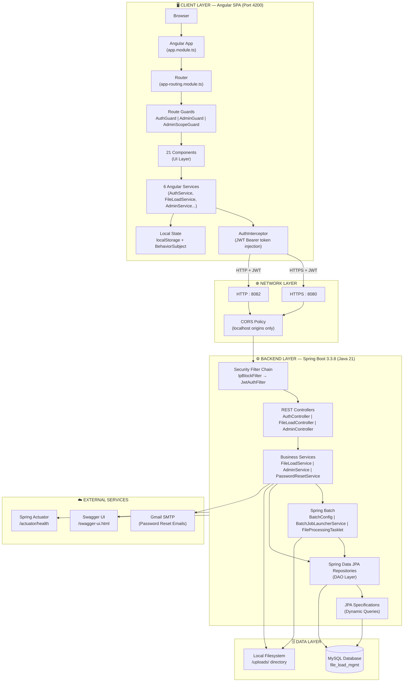
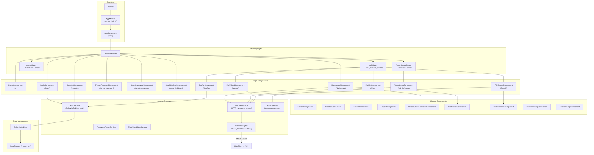
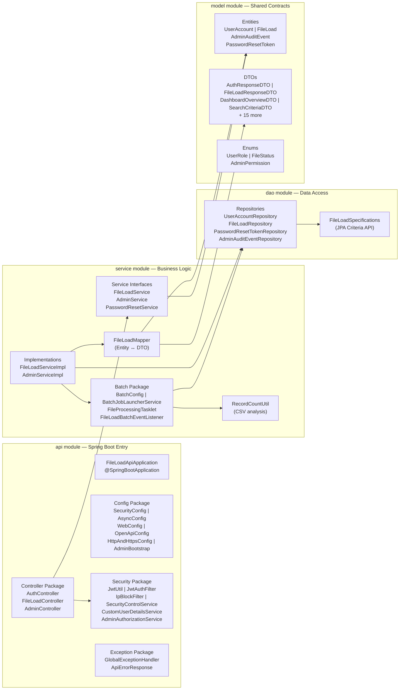
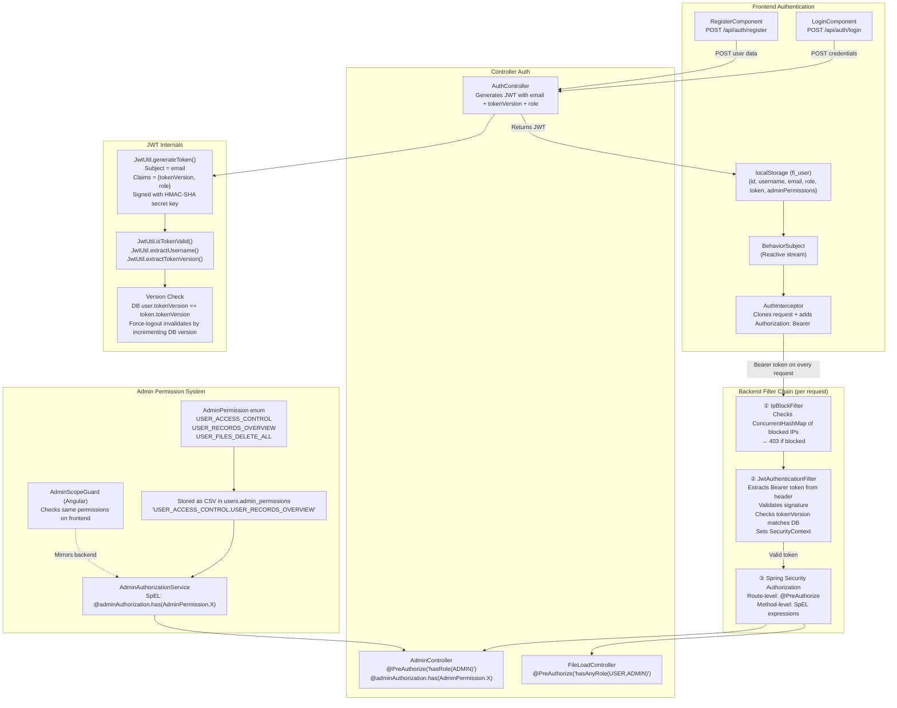
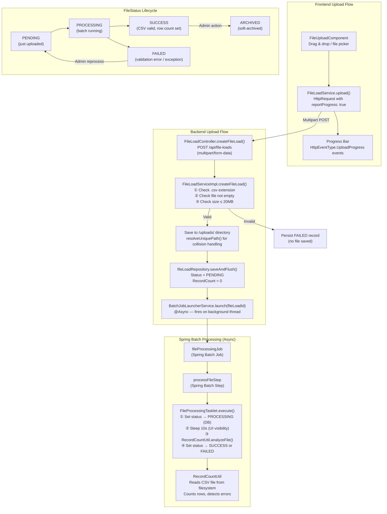
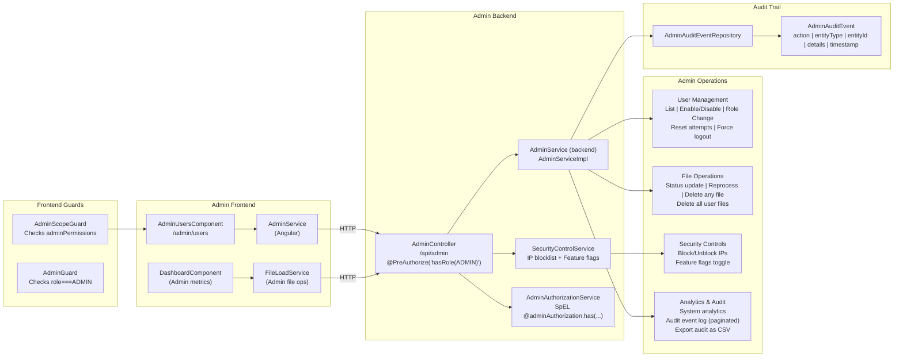
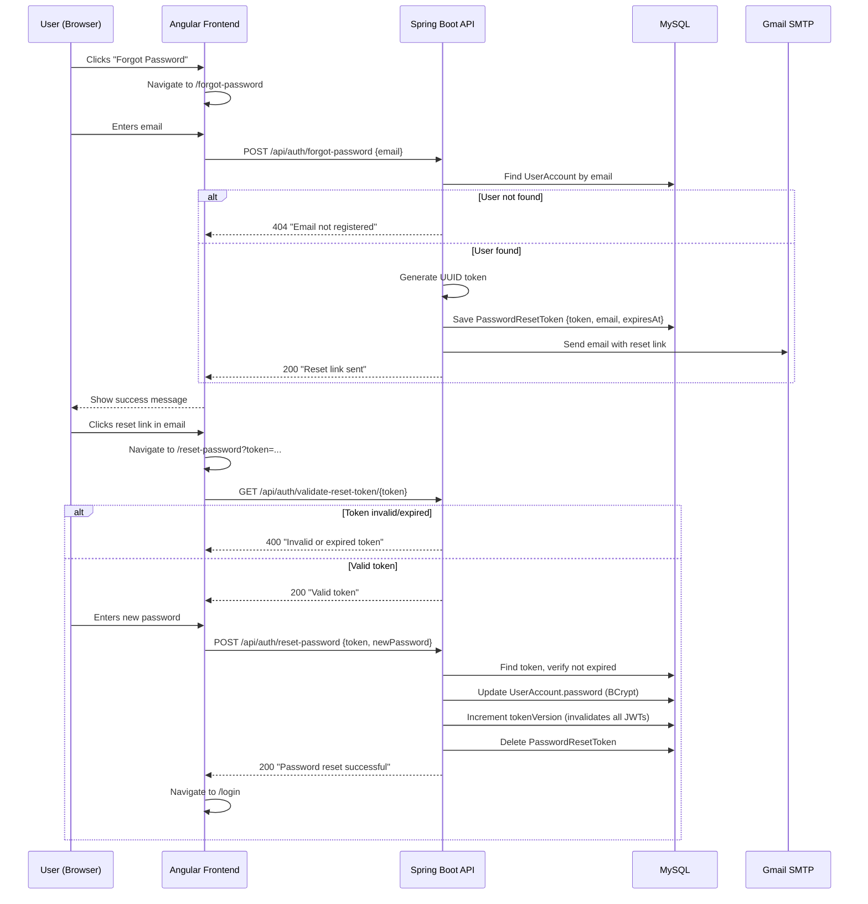
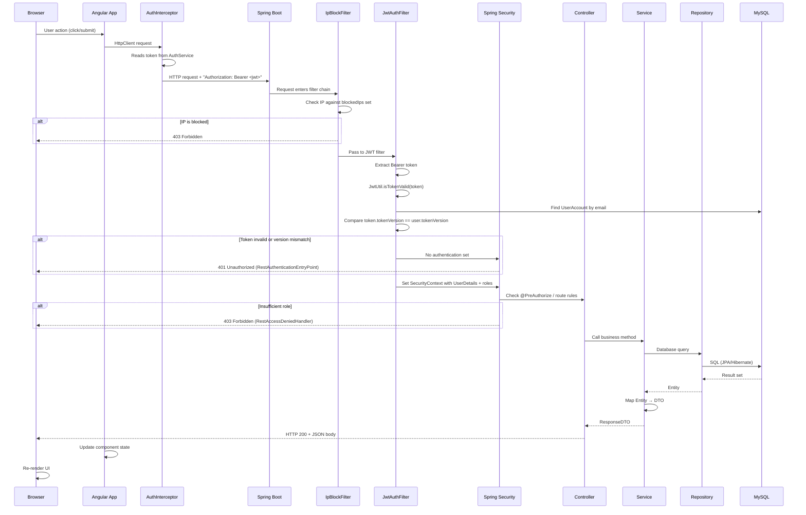
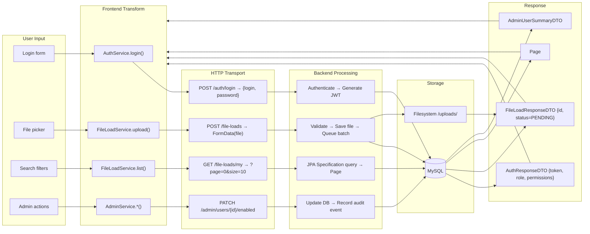
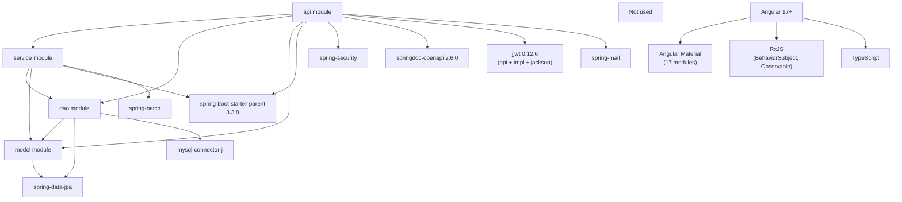

# 🏗️ ARCHITECTURE FLOW — DocIT File Management System

---

## 1. High-Level System Architecture

---

## 2. Frontend Architecture

---

## 3. Backend Architecture (Layered)

---

## 4. Security & Authentication Architecture

---

## 5. File Upload & Processing Architecture

---

## 6. Admin Architecture

---

## 7. Password Reset Flow

---

## 8. Complete Request-Response Lifecycle

---

## 9. Data Flow Diagram

---

## 10. Dependency Map

