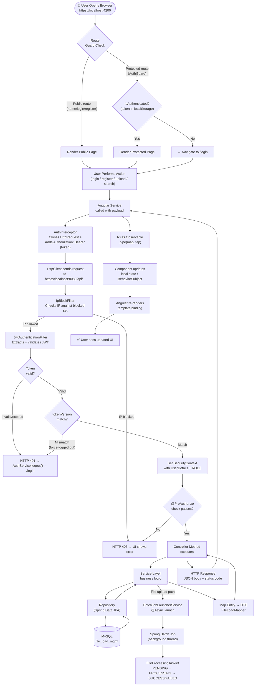
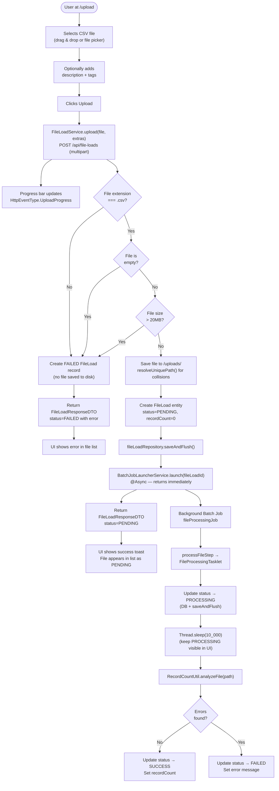
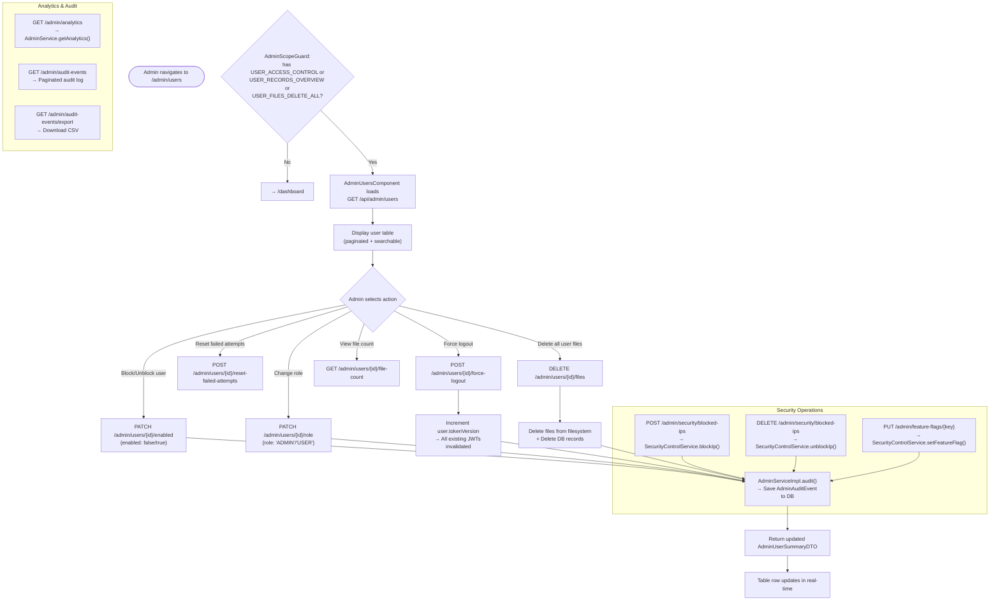
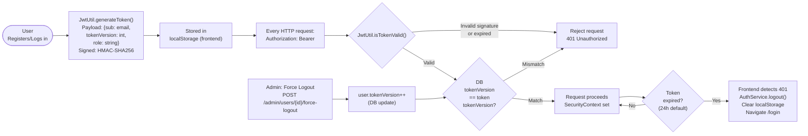
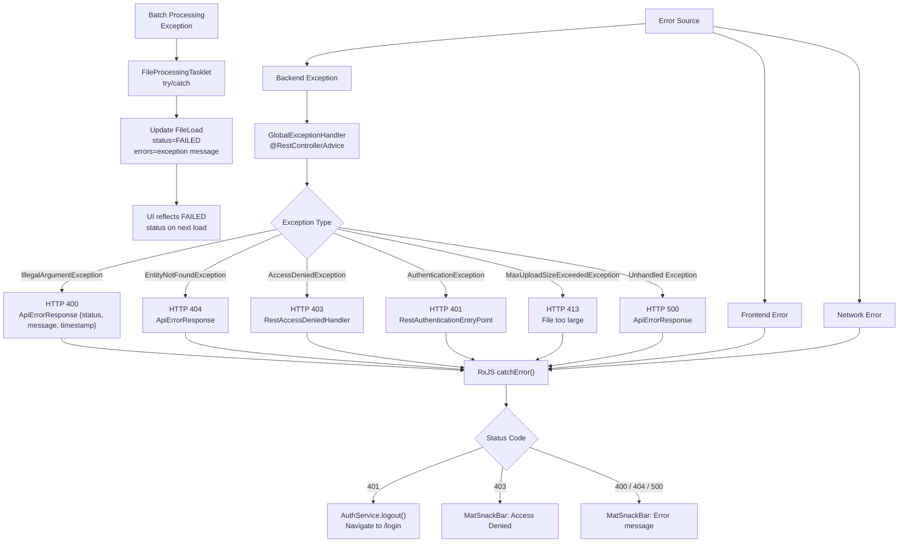
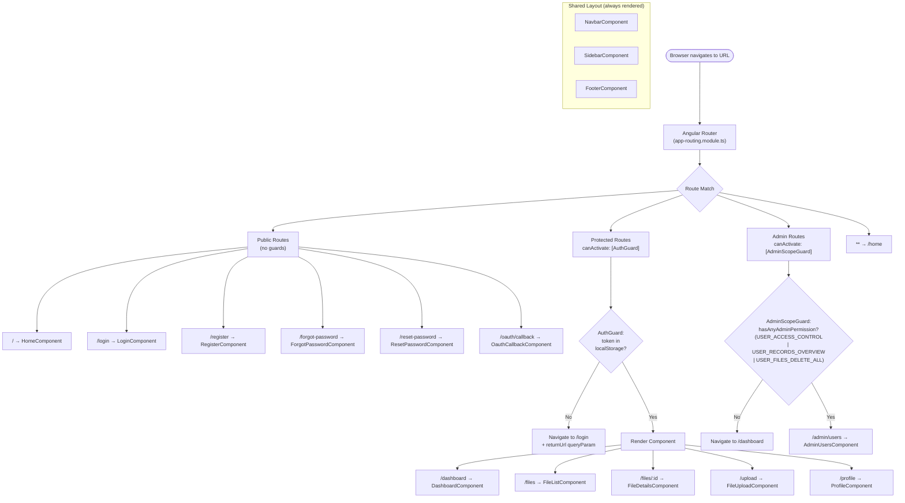
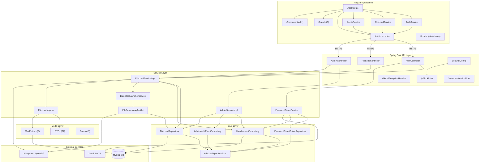
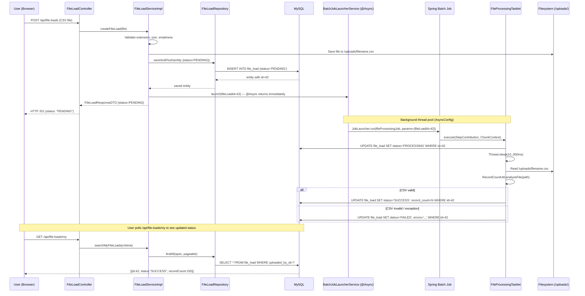
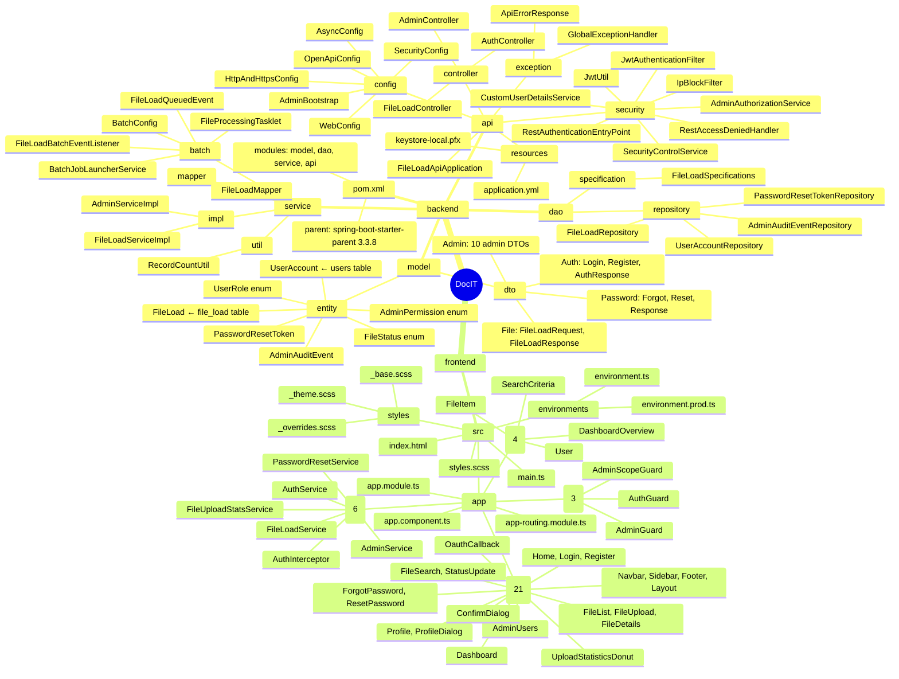

# 📊 FLOWCHARTS — DocIT File Management System

---

## 1. Complete Application Execution Flow

> **From user action → backend → database → response → UI update**

---

## 2. User Registration & Login Flowchart

```mermaid
flowchart TD
    subgraph REGISTER["Registration Flow"]
        R1(["User at /register"])
        R2["Fill username, email, password"]
        R3["Submit form"]
        R4{"Email already\nexists?"}
        R5{"Username already\nexists?"}
        R6["Save UserAccount\nrole=USER, enabled=true"]
        R7["Generate JWT\n{email, tokenVersion=0, role=USER}"]
        R8["Return AuthResponseDTO"]
        R9["Angular: localStorage.setItem('fl_user', ...)"]
        R10["BehaviorSubject.next(user)"]
        R11(["Navigate to /dashboard"])

        R1-->R2-->R3-->R4
        R4-->|"Yes"| ERR_R1["Error: Email exists"]
        R4-->|"No"| R5
        R5-->|"Yes"| ERR_R2["Error: Username exists"]
        R5-->|"No"| R6-->R7-->R8-->R9-->R10-->R11
    end

    subgraph LOGIN["Login Flow"]
        L1(["User at /login"])
        L2["Enter email/username + password"]
        L3["POST /api/auth/login"]
        L4{"User found\nin DB?"}
        L5{"User\nenabled?"}
        L6["Spring Security\nAuthenticationManager.authenticate()"]
        L7{"Credentials\nvalid?"}
        L8["Generate JWT\n{email, tokenVersion, role}"]
        L9["Return AuthResponseDTO"]
        L10["Angular: save to localStorage"]
        L11(["Navigate to /dashboard"])

        L1-->L2-->L3-->L4
        L4-->|"No"| ERR_L1["Error: Invalid credentials"]
        L4-->|"Yes"| L5
        L5-->|"No"| ERR_L2["Error: User is blocked"]
        L5-->|"Yes"| L6-->L7
        L7-->|"Wrong password"| ERR_L3["Error: Invalid credentials"]
        L7-->|"Valid"| L8-->L9-->L10-->L11
    end
```

---

## 3. File Upload Flowchart

---

## 4. Admin Operations Flowchart

---

## 5. JWT Token Lifecycle Flowchart

---

## 6. Error Handling Flow

---

## 7. Angular Routing & Navigation Flowchart

---

## 8. Module Interaction Chart

---

## 9. Async/Background Processing Flow

---

## 10. Folder Structure — Visual Map

